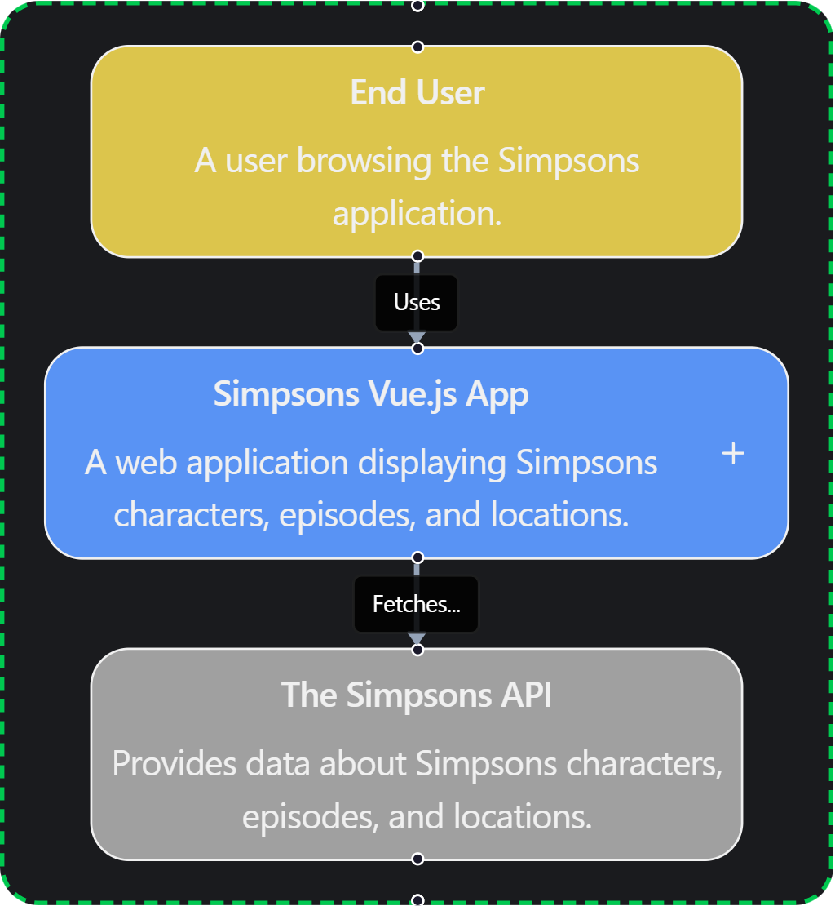

<div align="center">

# 🍩 The Simpsons App

**A modern, beautiful web application to explore the world of The Simpsons**

[](https://vuejs.org/)
[](https://tailwindcss.com/)
[](https://vitest.dev/)
[](https://www.docker.com/)

[Live Demo](https://userlg.github.io/The-Simpsons-App/) • [Report Bug](https://github.com/userlg/The-Simpsons-App/issues) • [Request Feature](https://github.com/userlg/The-Simpsons-App/issues)



</div>

---

## ✨ Features

- 🎨 **Modern UI/UX** - Beautiful design with Simpsons-inspired color palette
- 🌓 **Dark Mode** - Toggle between light and dark themes with localStorage persistence
- 🎵 **Theme Music** - Play the iconic Simpsons opening theme
- 📱 **Fully Responsive** - Works seamlessly on desktop, tablet, and mobile
- ⚡ **Fast & Optimized** - Built with Vite for lightning-fast performance
- 🧪 **Well Tested** - ~92% code coverage with comprehensive unit tests
- 🐳 **Docker Ready** - Deploy anywhere with Docker containers
- ♿ **Accessible** - SEO optimized and accessible design

## 🎯 Tech Stack

### Frontend Framework

- **Vue.js 3.5** - Progressive JavaScript framework
- **Vue Router 4** - Official routing solution
- **Composition API** - Modern Vue 3 approach

### Styling

- **Tailwind CSS 4** (Beta) - Utility-first CSS framework
- **PostCSS** - CSS transformation
- **CSS Variables** - Dynamic theming

### Build Tools

- **Vite 6** - Next-generation frontend tooling
- **@tailwindcss/vite** - Tailwind CSS 4 Vite plugin

### Code Quality

- **ESLint 9** - JavaScript linting (Flat Config)
- **Prettier** - Code formatting
- **Vitest 4** - Unit testing framework
- **@vue/test-utils** - Vue component testing
- **@vitest/coverage-v8** - Code coverage reporting

### API & Data

- **Axios** - HTTP client
- **The Simpsons API** - External API for character, episode, and location data

### DevOps

- **Docker** - Containerization
- **Nginx** - Production web server
- **Git** - Version control

## 🏗️ Architecture & Design Patterns

### Component Architecture

The application follows a **modular component-based architecture**:

```
src/
├── components/       # Reusable UI components
│   ├── AudioPlayer.vue
│   ├── Card.vue
│   ├── Hero.vue
│   ├── Navbar.vue
│   └── ThemeToggle.vue
├── views/           # Page-level components
│   ├── Home.vue
│   ├── Characters.vue
│   ├── Episodes.vue
│   └── Locations.vue
├── services/        # API and business logic
│   └── api.js
├── router/          # Routing configuration
└── assets/          # Static assets
```

### Design Patterns

1. **Composition API Pattern** - Leverages Vue 3's Composition API for better code organization and reusability

2. **Service Layer Pattern** - Centralized API calls in `services/api.js` with Axios interceptors for response normalization

3. **Component Composition** - Small, focused components that can be composed together

4. **Reactive State Management** - Using Vue's `ref` and `reactive` for state management

5. **Dark Mode Strategy** - CSS custom properties with class-based theme switching

## 🚀 Getting Started

### Prerequisites

- **Node.js** 18+ and **Yarn**
- Or **Docker** and **Docker Compose**

### Local Development

```bash
# Clone the repository
git clone https://github.com/userlg/The-Simpsons-App.git
cd simpsons-app

# Install dependencies
yarn install

# Start development server
yarn dev

# Open http://localhost:5173
```

### Other Commands

```bash
# Build for production
yarn build

# Preview production build
yarn preview

# Run tests
yarn test

# Generate coverage report
yarn coverage

# Lint and fix code
yarn lint
```

## 🐳 Docker Deployment

### Using Docker Compose (Recommended)

```bash
# Build and start the container
docker-compose up -d

# View logs
docker-compose logs -f

# Stop the container
docker-compose down
```

The app will be available at **http://localhost:8080**

### Using Docker directly

```bash
# Build the image
docker build -t simpsons-app .

# Run the container
docker run -d -p 8080:80 --name simpsons-vue-app simpsons-app

# Stop the container
docker stop simpsons-vue-app
docker rm simpsons-vue-app
```

## 🧪 Testing

The project has comprehensive test coverage (~92%):

```bash
# Run all tests
yarn test

# Generate coverage report
yarn coverage

# Open coverage report
open coverage/index.html
```

**Test Suites:**

- ✅ API Service (100% coverage)
- ✅ All Views (100% coverage)
- ✅ Core Components (90%+ coverage)

## 📦 Project Structure

```
simpsons-app/
├── public/              # Static assets
├── src/
│   ├── assets/         # Audio, images
│   ├── components/     # Vue components
│   ├── router/         # Vue Router config
│   ├── services/       # API services
│   ├── views/          # Page components
│   ├── App.vue         # Root component
│   ├── main.js         # Entry point
│   └── style.css       # Global styles
├── coverage/           # Test coverage reports
├── dist/              # Production build
├── Dockerfile         # Docker configuration
├── docker-compose.yml # Docker Compose config
├── vitest.config.js   # Test configuration
├── vite.config.js     # Vite configuration
└── eslint.config.js   # ESLint configuration
```

## 🎨 Color Palette

The app uses the iconic Simpsons color scheme:

```css
--color-simpson-yellow: #ffd90f;
--color-simpson-blue: #0c6cbf;
--color-simpson-pink: #d14294;
--color-simpson-text: #333333;
```

## 🤝 Contributing

Contributions are welcome! Please feel free to submit a Pull Request.

1. Fork the project
2. Create your feature branch (`git checkout -b feature/AmazingFeature`)
3. Commit your changes (`git commit -m 'Add some AmazingFeature'`)
4. Push to the branch (`git push origin feature/AmazingFeature`)
5. Open a Pull Request

## 📝 License

This project is open source and available under the [MIT License](LICENSE).

## 👤 Author

**GitHub:** [@usrlg](https://github.com/userlg)

## 🙏 Acknowledgments

- [The Simpsons API](https://thesimpsonsapi.com/) for providing the data
- [Vue.js Team](https://vuejs.org/) for the amazing framework
- [Tailwind Labs](https://tailwindcss.com/) for Tailwind CSS
- The Simpsons for decades of entertainment

---

<div align="center">

Made with ❤️ and 🍩

**[⬆ Back to Top](#-the-simpsons-app)**

</div>
